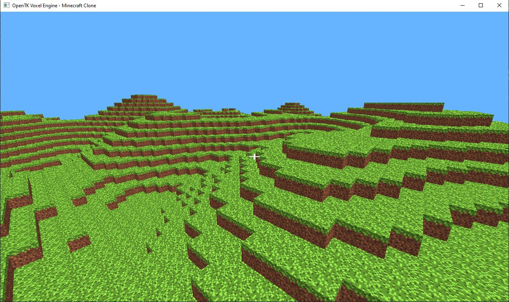
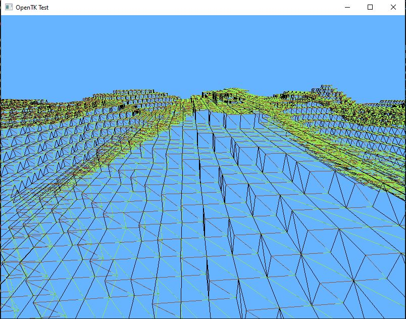
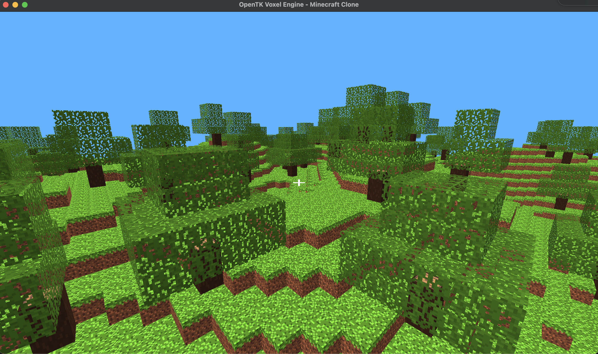
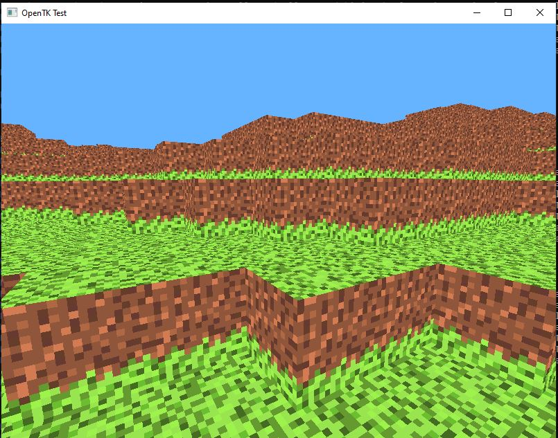
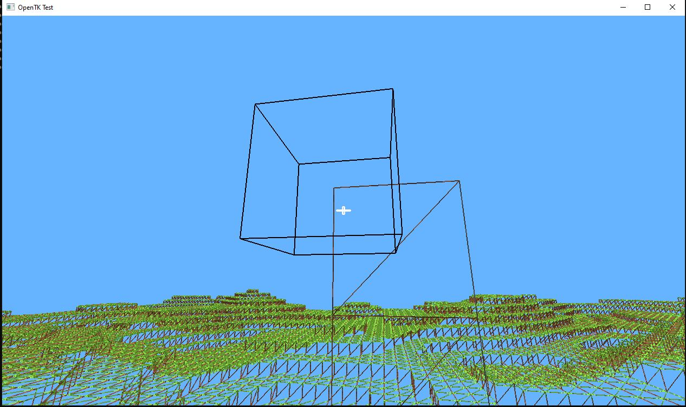
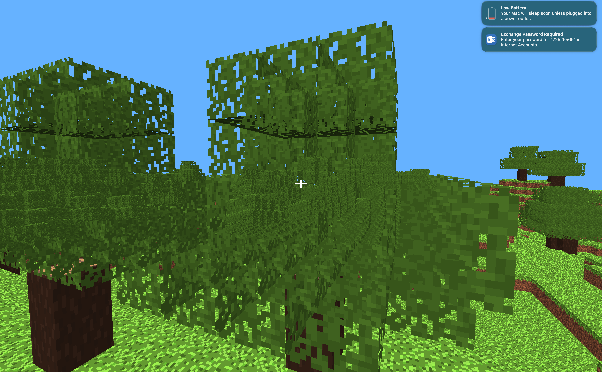
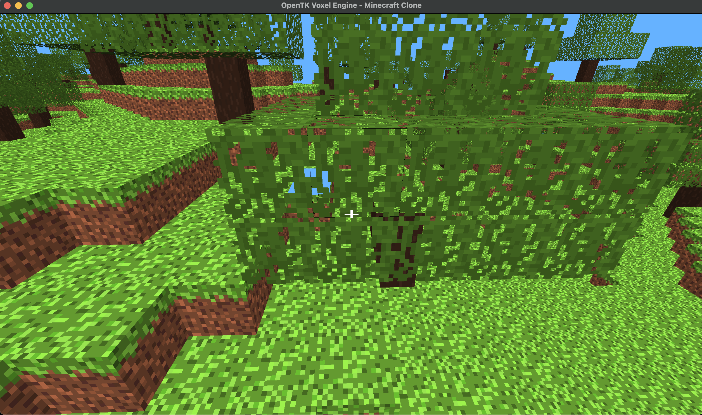

# OpenTK Voxel Engine - Minecraft Clone

A Minecraft-style voxel engine built in C# using OpenTK and OpenGL.



# Features

- Infinite procedurally generated terrain using Simplex noise
- Chunk-based world management with configurable render distance
- Greedy face culling (only visible faces are rendered)
- Texture atlas support with per-face UV mapping
- Face shading / ambient lighting for visual depth
- Transparent block support (glass) with two-pass rendering
- Block placement and removal with raycast
- Block outline highlight on targeted block
- First-person camera with mouse look
- Multiple block types with number key selection
- Crosshair UI
- Wireframe debug mode (F key)

# Screenshots

### Terrain


### Wireframe View


### Tree Generation


# Development Journey

## Bug Fixes Along the Way

### Black faces (winding order)


Early build had incorrect vertex winding order on Back, Right and Left faces causing them to render black or be culled.

### Texture rotation


Side face textures were rendering upside down due to OpenGL's bottom-left UV origin vs image top-left origin.

### Raycast block outline


Raycast debugging with block outline to align break/place targeting with the crosshair.

### Tree Generation


Tree rendering was incorrect due to shader and leaves being transparent



Faces of blocks next to leaves would be culled when they should be visible  

## Controls

| Key | Action |
|-----|--------|
| W A S D | Move |
| Space | Fly up |
| Left Shift | Fly down |
| Mouse | Look around |
| Left Click | Break block |
| Right Click | Place block |
| 1-6 | Select block type |
| F | Toggle wireframe |
| R | Toggle cursor lock |
| Escape | Quit |

## Block Types

| Key | Block |
|-----|-------|
| 1 | Dirt |
| 2 | Stone |
| 3 | Glass |
| 4 | Wood |
| 5 | Sand |
| 6 | Pink Heart |

## Project Structure
```
MinecraftClone-CSharp/
├── openTKTest.csproj
├── Program.cs
├── README.md
│
├── Core/
│   ├── Game.cs
│   ├── Shader.cs
│   └── Camera.cs
│
├── World/
│   ├── World.cs
│   ├── Chunk.cs
│   ├── Block.cs
│   ├── BlockType.cs
│   ├── Terrain.cs
│   └── Noise.cs
│
├── Rendering/
│   ├── TextureAtlas.cs
│   └── TextRenderer.cs
│
├── Assets/
│   └── Textures/
│       └── Atlas.png
│
├── Shaders/
│   ├── shader.vert
│   ├── shader.frag
│   ├── crosshair.vert
│   ├── crosshair.frag
│   ├── outline.vert
│   ├── outline.frag
│
└── Screenshots/
    ├── WorldGen.JPG
    ├── WireFrame.JPG
    ├── TextureError.JPG
    ├── RotationError.JPG
    └── RaycastIssue.JPG
```

## Dependencies

- [OpenTK 4.9.4](https://opentk.net/) - OpenGL bindings for .NET
- [StbImageSharp 2.30.15](https://github.com/StbSharp/StbImageSharp) - Image loading
- .NET 10.0

## Building
```bash
dotnet build
dotnet run
```
